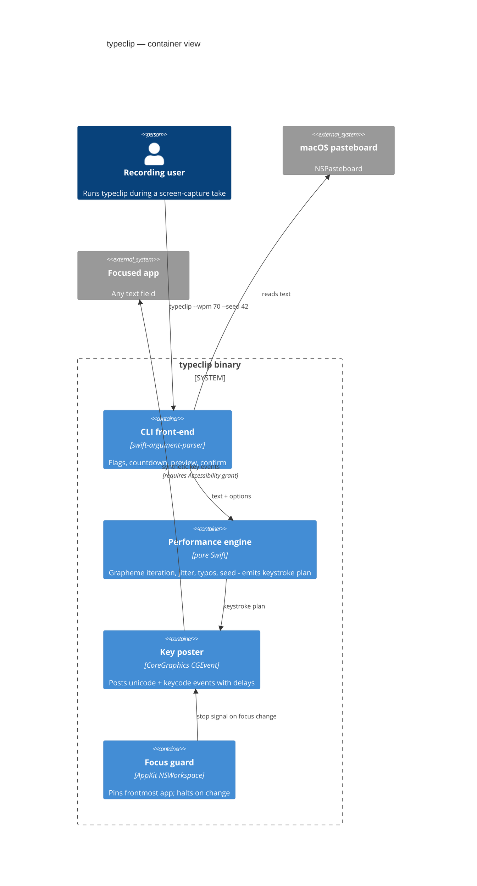

# typeclip — clipboard → human-cadence typing (design spec)

**Date:** 2026-07-10
**Status:** Approved (brainstorming session with Joe, 2026-07-10)
**Repo:** `github.com/cssllcio/typeclip` (public) · **License:** MIT · **Binary/formula name:** `typeclip`

## Summary

`typeclip` is a standalone macOS command-line tool that reads text from the clipboard and types it into whatever text field currently has focus, with human rhythm — jittered keystroke timing, natural pauses, optional typo-and-correction performances, and seeded reproducibility. It exists because pasted text looks fake on camera: the primary use case is screen recordings and demo videos where text must *look* naturally typed. It is distributed as a signed, notarized universal binary via GitHub Releases and a Homebrew tap.

`typeclip` is a personal/CSS LLC utility, **not a Vibrai surface** — it has no relationship to the Vibrai engine, so the Vibrai MCP↔CLI parity rule does not apply (recorded here as the explicit one-line justification).

**Prior art:** `jlaundry/TypeClipboard` and `ArbenP/TypeClipboard` type the clipboard for paste-blocked/remote sessions. Neither models human cadence nor offers reproducible performances; that realism engine is typeclip's reason to exist. The name `typeclip` is unclaimed on GitHub and in homebrew-core (verified 2026-07-10).

## Goals

1. Text on screen appears typed by a human — convincing rhythm at normal playback speed.
2. Reproducible takes: the same `--seed` yields the identical keystroke performance, so retakes match for editing.
3. Zero-dependency install for end users: one binary, `brew install cssllcio/tap/typeclip`.
4. Safe by default: no keystrokes sprayed into the wrong window; oversized clipboards confirmed first.

## Non-goals (v1)

- Global hotkey, menu-bar app, or any GUI.
- Digraph-aware speed modeling (common letter pairs typed faster).
- Targeting specific windows by title; multi-display awareness.
- Linux/Windows support.
- Being a Vibrai feature (no MCP tool, no `vibrai` subcommand).

## Decisions log

| Decision | Choice | Rationale |
|---|---|---|
| Primary use case | Demo/screen recordings | Chosen over social-field pasting, remote sessions, general utility |
| Trigger | CLI + countdown | Fits `~/bin`/terminal workflow; hotkey hosts (Hammerspoon etc.) not installed and not wanted |
| Realism | Variable rhythm + typos/corrections + `--seed` | All three selected; constant-speed available via `--flat` |
| Newlines | All four behaviors, flag-selected | `--newline shift-enter` (default) \| `enter` \| `strip`, plus `--submit` |
| Implementation | Swift + CGEvent, SwiftPM | Most portable/packageable: single static-ish binary, system frameworks only |
| Packaging | Full release pipeline from day one | Signed + notarized binary, GitHub Releases, Homebrew tap |
| Repo home | `cssllcio` org | Consistent with `vibrai-releases` as the public face |
| License | MIT | Standard for small dev tools |
| Typo default | `--typo-rate 0` (off) | Surprise backspaces in an unplanned take are worse than opting in |

## CLI contract

```
USAGE: typeclip [options]

Reads the clipboard (or --text/stdin) and types it into the focused field.

COUNTDOWN & TARGETING
  -d, --delay <sec>      Countdown before typing starts (default: 5).
                         Prints char count + first-line preview, then 5…4…3…
  --app <name>           Activate this app right before typing (e.g. "Claude").

RHYTHM
  --wpm <n>              Target speed (default: 70). Per-key delays are
                         log-normally jittered around this; extra pauses after
                         punctuation, spaces, and newlines.
  --flat                 Constant delay, no jitter (mechanical mode).
  --typo-rate <p>        Probability per word of a typo + backspace correction
                         (default: 0 = off; 0.02 is a good on-camera value).
  --seed <n>             Reproducible performance — same seed, same take.
                         Default: random; the chosen seed is always printed
                         so any take can be reproduced after the fact.

TEXT HANDLING
  --newline <mode>       shift-enter (default) | enter | strip
  --submit               Press Enter once after all text is typed.
  --text <string>        Type this instead of the clipboard. "-" reads stdin.

OTHER
  --dry-run              Print the keystroke timeline; don't type anything.
  --yes                  Skip the confirm prompt for clipboards > 2,000 chars.
  --version              Build version (stamped from git tag in CI).
```

Exit codes: `0` success · `1` --app activation failure · `2` halted by focus change · `3` Accessibility not granted · `4` no text (empty clipboard/stdin) · `5` user declined the oversize confirm. Countdown, preview, and progress go to **stderr**; `--dry-run`'s timeline goes to **stdout** (pipeable).

## Typing engine

The engine is pure logic: `(text, options, seed) → [KeystrokeEvent]` where each event is `{action, payload, delayBeforeMs}` and `action ∈ {typeCluster, keyDown/keyUp keycode, backspace}`. Nothing in the engine imports CoreGraphics — the same plan feeds both the real key poster and `--dry-run`.

**Grapheme handling.** Text is iterated per Swift `Character` (grapheme cluster), so emoji, accents, and CJK each count as one keystroke. Clusters are posted via `CGEventKeyboardSetUnicodeString` with the cluster's full UTF-16 unit array in a single keyDown/keyUp pair; clusters exceeding 20 UTF-16 units (rare ZWJ chains) are split across consecutive events with no inter-event delay.

**Rhythm model.** Base mean inter-key delay = `60000 / (wpm × 5)` ms (70 WPM ≈ 171 ms). Each delay is drawn from a log-normal whose underlying normal has σ = 0.35 and whose μ is set so the distribution's *mean* equals the base delay (μ = ln(base) − σ²/2), then multiplied by context:

| After… | Multiplier |
|---|---|
| sentence punctuation `. ! ?` | ×3.5 |
| clause punctuation `, ; :` | ×2.0 |
| space | ×1.3 |
| newline | ×5.0, capped at 1,200 ms |

`--flat` bypasses jitter and multipliers: constant base delay.

**Typo model** (active when `--typo-rate > 0`). Eligibility is decided once per word with probability `p`. A typo performance: substitute one seeded-randomly chosen eligible character in the word with a QWERTY-adjacent key (letters/digits only — never punctuation, emoji, or modifier-bearing keys), continue typing 1–2 further correct characters, pause 300–700 ms ("noticing"), backspace over the overshoot plus the wrong character at ~2× base speed, then retype the corrected sequence. Typos never occur within the final 3 graphemes of the text, so performances always end clean.

**Determinism.** One SplitMix64 PRNG seeded from `--seed` drives every random draw (jitter, typo placement, adjacent-key choice, notice-pause). Same seed + same text + same options ⇒ byte-identical plan. When `--seed` is omitted a random seed is generated and printed to stderr, so any accidental great take is reproducible.

**Special keys.** Newline as Shift+Enter = keycode 36 with shift flag; plain Enter = keycode 36; Backspace = keycode 51. `--submit` appends a final plain-Enter event 500 ms after the last character.

## Safety & permissions

- **Accessibility gate.** On start, `AXIsProcessTrustedWithOptions(prompt: true)` — if untrusted, the system prompt appears and typeclip prints which app needs the grant (the grant binds to the hosting terminal when run from one) plus the System Settings path, then exits `3`. Headless/SSH sessions fail here by design.
- **Focus guard.** At first keystroke the frontmost application (`NSWorkspace.shared.frontmostApplication`) is pinned. Before every keystroke the guard re-checks; any change (user clicks elsewhere, Cmd+Tab, a dialog steals focus) halts typing immediately, exit `2`. This doubles as the mid-take abort: physically Cmd+Tab and it stops. (Poll cost is trivial at human typing speeds.)
- **Countdown window.** During the countdown the terminal is still frontmost, so Ctrl+C aborts cleanly. The preview (char count + first ~60 chars, escaped) shows exactly what is about to be typed before it happens.
- **Oversize confirm.** Clipboards over 2,000 characters require an interactive `y` unless `--yes`.
- `--app <name>` activates the named app (NSWorkspace) after the countdown and before the first keystroke, then pins *it* as the focus-guard target.

## Architecture

SwiftPM executable, minimum macOS 12, universal binary (arm64 + x86_64). One dependency: `apple/swift-argument-parser` (statically compiled in; the shipped binary stays self-contained).

| Module | Does | Depends on |
|---|---|---|
| `CLI` (main) | Flag parsing, countdown, preview, confirm, wiring | ArgumentParser, all below |
| `PerformanceEngine` | text + options + seed → keystroke plan | Foundation only (pure, unit-testable) |
| `KeyPoster` | Posts plan events as CGEvents with delays | CoreGraphics |
| `FocusGuard` | Pins frontmost app, signals halt | AppKit (NSWorkspace) |
| `ClipboardSource` | Clipboard / `--text` / stdin resolution | AppKit (NSPasteboard) |

Each unit answers: what it does (above), how to use it (single entry function), what it depends on (above). `PerformanceEngine` can change internals freely as long as the plan format holds; `KeyPoster` and `--dry-run` are interchangeable consumers of the same plan.



## Testing strategy

1. **Engine unit tests (core suite, runs in CI).** Determinism (same seed ⇒ identical plan; different seed ⇒ different plan), newline-mode transforms, typo invariants (never punctuation/emoji, never in last 3 graphemes, backspace count matches overshoot), rhythm bounds (multipliers applied, delays positive), grapheme integrity (emoji/ZWJ round-trip through plan payloads).
2. **`--dry-run` golden tests.** Fixed seed + fixed text ⇒ committed golden timeline; catches accidental engine drift. Runs in CI (no Accessibility needed).
3. **CLI-level tests.** Exit codes for empty clipboard, declined confirm; stderr/stdout separation.
4. **Manual integration recipe (cannot run in CI — Accessibility).** Documented in README: grant Accessibility to the terminal, `pbcopy` a fixture containing emoji + newlines, run `typeclip -d 3 --seed 42 --typo-rate 0.02` into TextEdit, verify text matches the clipboard exactly and the performance looks human; repeat same seed and verify identical rhythm; Cmd+Tab mid-take and verify immediate halt with exit 2. This recipe is the integration gate for every release.

## Release & distribution

- **Repo:** `cssllcio/typeclip`, public, MIT. Default branch `main`.
- **CI (every push/PR):** `swift build && swift test` on macOS runner.
- **Release (tag `v*`):** build universal binary (`swift build -c release --arch arm64 --arch x86_64`), `codesign` with Developer ID Application (Team ID 7DT678RSG7 — secret contract cribbed from Vibrai's `release.yml`), zip, `notarytool submit --wait`. Bare Mach-O binaries cannot be stapled; Gatekeeper verifies notarization online, which is standard for CLI tools. Publish GitHub Release with the zip + SHA256.
- **Homebrew tap:** `cssllcio/homebrew-tap` (create if absent) with a binary formula pointing at the notarized release zip — users need no Xcode. Formula bump automated in the release workflow.
- **Versioning:** git tags (`v0.1.0`…). CI generates a `Version.swift` from the tag; local builds report `dev`. `--version` prints it.

## Implementation-plan pointers

- Repo + org setup (`gh repo create cssllcio/typeclip --public`) happens as the plan's first task — not done during design.
- Signing/notarization secrets: reuse the names and setup steps documented in Vibrai's `release.yml` / O2 signing notes.
- Every plan ends with the manual integration recipe (§Testing 4) executed once end-to-end, including the Homebrew install path on a clean machine/user account if feasible.
